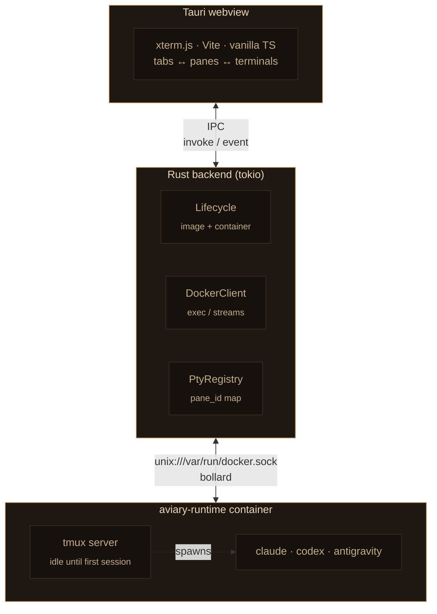

# Aviary

A home for your AI coding agents.

Tauri desktop app that runs **Claude Code**, **Codex**, and **Antigravity** CLIs inside a single sandboxed Docker container, multiplexed via tmux. Each tab in the window = one tmux session = one agent. Aviary spawns and manages the container itself — no `docker compose` step.

## Why

Running multiple agent CLIs locally is messy: separate terminals, separate auth, no unified view, no isolation. Aviary cages each agent in its own tmux session inside one container, and gives you a single window to switch between them.

## Architecture



### Boot sequence

```mermaid
sequenceDiagram
    autonumber
    participant UI as Frontend
    participant LC as Lifecycle
    participant D as Docker
    participant C as aviary-runtime

    UI->>LC: ensure_runtime (spawn bg)
    LC->>D: pull ghcr.io/mpolatcan/aviary-runtime:&lt;ver&gt;
    Note right of D: ~10–20s first run only
    LC->>D: create container + volume mounts
    D->>C: start
    LC-->>UI: emit aviary://lifecycle (running)
    UI->>LC: list_sessions
    LC-->>UI: existing tmux sessions
    UI->>UI: restore tabs
```

### Per-session lifecycle (user clicks **+**)

```mermaid
sequenceDiagram
    autonumber
    participant UI as Frontend
    participant B as Backend
    participant T as tmux (in container)

    UI->>UI: CLI picker modal (claude / codex / antigravity)
    UI->>B: create_session(name, cli)
    B->>T: docker exec ... tmux new-session -d -s &lt;name&gt; &lt;cli&gt;
    UI->>B: attach_session(name, cols, rows)
    B->>T: bollard exec tty=true · tmux attach -t &lt;name&gt;
    B-->>UI: pane_id
    loop while attached
        T-->>B: stdout chunks
        B-->>UI: pty://data/&lt;pane_id&gt;
        UI->>B: pty_write(paneId, data)
        B->>T: stdin
        UI->>B: pty_resize(paneId, cols, rows)
        B->>T: TIOCSWINSZ
    end
```

## Runtime image

Lives in `runtime/`. See `runtime/README.md` for build and publish instructions.

## Prerequisites

- Rust toolchain (`rustup`, stable)
- Node 20+
- Docker Desktop running
- macOS / Linux (Windows untested)

## Setup

```bash
cd /Users/mutlu.polatcan/aviary
npm install

# Build runtime image locally (or wait for app to pull from registry)
docker build -t ghcr.io/mpolatcan/aviary-runtime:0.1.0 runtime/

# Dev mode (hot reload frontend, rebuild Rust on change)
npm run tauri dev
```

Override defaults:

| Env var | Purpose | Default |
|---|---|---|
| `AVIARY_CONTAINER` | Container name | `aviary-runtime` |
| `AVIARY_IMAGE` | Image tag to use | `ghcr.io/mpolatcan/aviary-runtime:0.1.0` |
| `AVIARY_NETWORK_MODE` | Docker network mode | `bridge` |
| `CLAUDE_CODE_OAUTH_TOKEN` | Skip `/login` in Claude Code | unset |

## Production build

```bash
npm run tauri build
```

Bundles a `.dmg` on macOS, `.AppImage`/`.deb` on Linux. Output at `src-tauri/target/release/bundle/`.

## Volume layout

Aviary stores all state under the OS app-data dir.

| Host path (macOS) | Container path | Purpose |
|---|---|---|
| `~/Library/Application Support/com.mutlupolatcan.aviary/config` | `/config` | Per-CLI auth state |
| `~/Library/Application Support/com.mutlupolatcan.aviary/workspace` | `/workspace` | Project files |

## Roadmap

- macOS Keychain for OAuth token storage (`security-framework` crate).
- Bell-character detection -> native notification when an agent finishes.
- Split panes (tmux split-window), copy mode keybindings, session rename.
- Multiple workspaces (one container per workspace dir).
- Auto-update via Tauri updater plugin.
- Icon set (cage grid + bird silhouette).
